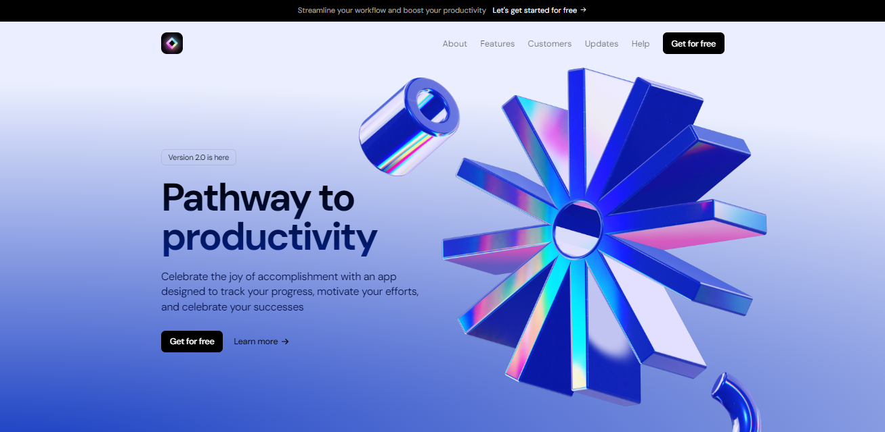
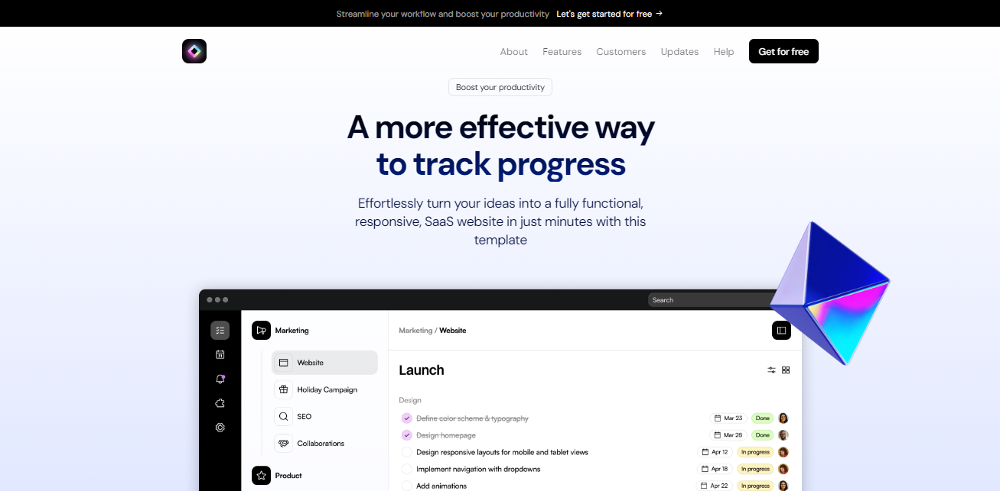
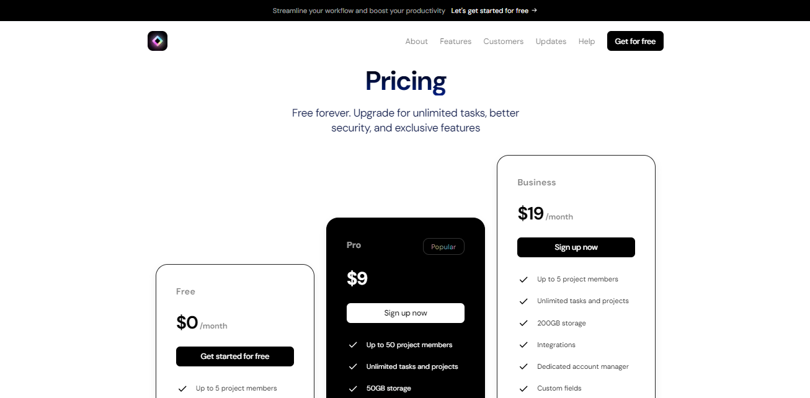
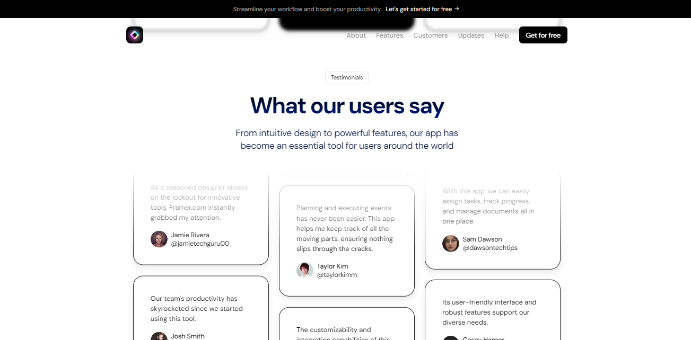
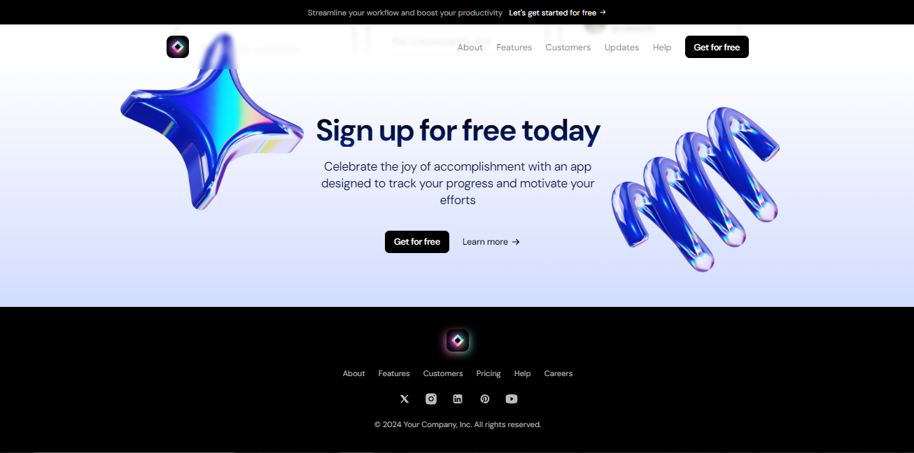

# About the Landing Page 

This is a SaaS Landing Page Light Mode built by `Diego Tech` by using:

- Next.js
- TypeScript

<br />







<br />

## Libraries I used for the Web 🚀

- CLSX
- Framer Motion
- TailwindCSS

#

### One Message for EveryOne 🔥

> [!TIP]
> ```shell
> Aguante Argentina!!!
> Aguante Messi!!!
> ```